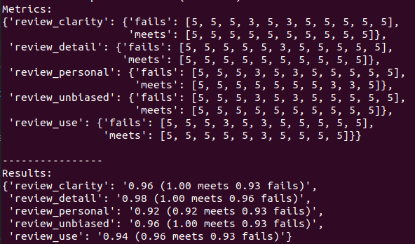

# Udacity Ratings Calculator

This is a tiny Python code for Udacity who are curious about their rating scores.

The usual process for doing this was:

1. Go to the [Feedback Analyzer app](https://udacity-mentor-feedback-viewer.web.app/)
2. Analyze Feedback.
3. Go through the painful process of clicking "Open Review" link one-by-one to get
10 passed and 10 failed projects and take note of their ratings.
4. Calculate the average ratings for each measurement metric.

This code automates that process by using Selenium to automatically log into your account and extract the ratings one by one. At the end of the process, the script calculates your Udacity rating scores.

## How To Setup and Run

1. If you don't already have it, download [ChromeDriver](https://sites.google.com/chromium.org/driver/downloads) and place it somewhere in your local directory. In my case it is located at `/usr/lib/chromium-browser/chromedriver`.
2. Make a copy of the `config.cfg.default` file and rename it to `config.cfg`.
3. setup the USERNAME, PASSWORD, and CHROMEDRIVER_PATH configurations in the `config.cfg` file.
4. Run `python main.py` command from the terminal/command prompt.
5. If you just need to run the report without connecting to Udacity website, `python report.py`.

The script will report your score for each of the 5 metrics (`review_use`, `review_clarity`, `review_detail`, `review_personal`, and `review_unbiased`). It also gives you the scores for only the meet specs and fail specs projects. Here is a sample output (with real data):

## Troubleshootings

Sometimes you may get the following error:

### selenium.common.exceptions.TimeoutException: Message:

and when you tried to login manually to Udacity's mentorship page, it says you are not a mentor. This is because Udacity website had kicked you out, maybe out of suspicion that you are a bot (which you are). When this happens, wait a few minutes and then re-run the main.py script again. This problem has been attempted to be mitigated by the scripts via the following mechanisms:

1. There are random wait periods after connecting to the Udacity website to mimic a flesh automaton (i.e. a human).
2. The `data.csv` file acts as a checkpoint so you do not have to re-download all of the files again.
